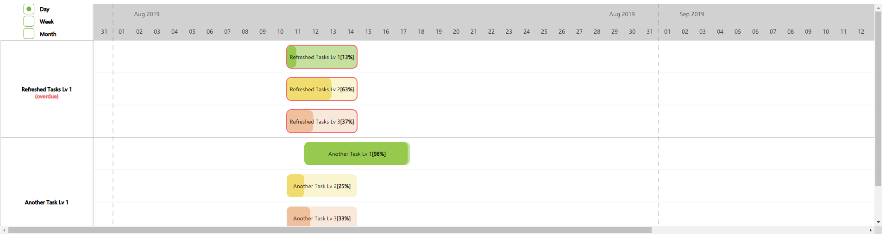

<div align="center">
    <h2>Ai Gantt Chart</h2>
    <p align="center">
        <p>This library was created using
            <a href="https://frappe.github.io/gantt">
            <b>Frappe Gantt</b>
             </a>javascript lib as base.
         </p>
    </p>
</div>

###### Gantt Leveled Tasks
 

> #### There are 4 Tasks Level on Gantt
>> Level 0: Is a project, groups all tasks (Blue color)
>
>> Level 1: Is also a grouper and has a task list of tasks with levels 2 and 3 
>
>> Level 2 and 3: Has no 'child' tasks and is represented by Yellow and Light Orange color
>
> #### There are 3 filter options on UI
>> Day, Week and Month.


### Install
```
npm install ai-gantt-chart
```

### Styles
Sometimes you need to add the `styles.css` manually to your project.


### Example
```js
return [
  {
    start: '2019-08-05',
    end: '2019-08-20',
    name: 'Refreshed Project',
    id: 'TaskModel 0',
    progress: 55,
    level: 0,
    overdue: true,
    showOnGraph: true,
    taskList: [
      {
        start: '2019-08-11',
        end: '2019-08-15',
        name: 'Refresh Tasks Lv 1',
        id: 'TaskModel 1',
        progress: 13,
        showOnGraph: true,
        level: 1,
        overdue: true,
        taskList: [
          {
            start: '2019-08-11',
            end: '2019-08-15',
            name: 'Refreshed Tasks Lv 2',
            id: 'TaskModel 2',
            progress: 63,
            showOnGraph: true,
            level: 2,
            overdue: true
          },
          {
            start: '2019-08-11',
            end: '2019-08-15',
            name: 'Refreshed Tasks Lv 3',
            id: 'TaskModel 3',
            progress: 37,
            showOnGraph: true,
            level: 3,
            overdue: true
          }
          ,
          {
            start: '2019-08-11',
            end: '2019-08-15',
            name: 'Refreshed Tasks Lv 4',
            id: 'TaskModel 4',
            progress: 43,
            showOnGraph: true,
            level: 3,
            overdue: true
          }
        ]
      },
      {
        start: '2019-08-12',
        end: '2019-08-18',
        name: 'Another Task Lv 1',
        id: 'TaskModel 5',
        progress: 98,
        level: 1,
        overdue: false,
        showOnGraph: true,
        taskList: [
          {
            start: '2019-08-11',
            end: '2019-08-15',
            name: 'Another Task Lv 2',
            id: 'TaskModel 6',
            progress: 25,
            showOnGraph: true,
            level: 2,
            overdue: false
          },
          {
            start: '2019-08-11',
            end: '2019-08-15',
            name: 'Another Task Lv 3',
            id: 'TaskModel 7',
            progress: 33,
            showOnGraph: true,
            level: 3,
            overdue: false
          }
          ,
          {
            start: '2019-08-11',
            end: '2019-08-15',
            name: 'Another Task Lv 4',
            id: 'TaskModel 8',
            progress: 100,
            showOnGraph: true,
            level: 3,
            overdue: false
          }
        ]
      }
    ]
  }
];
```

###### Task Model
* **start** and **end** must adhere to the format "YYYY-MM-DD"
* **progress** value between 0 and 100 representing the percentage of task conclusion
* **showOnGraph** is used to show/hide the bar on Gantt
* The **level** is used to set the color and header for lvl. 1, when applicable
* **Overdue** is used to represent a delay on the end


You can also pass various options to the Gantt constructor:
```js
const defaultOptions: GanttOptions = {
  headerHeight: 80,
  columnWidth: 30,
  step: 24,
  viewModes: [
    ViewMode.QuarterDay,
    ViewMode.HalfDay,
    ViewMode.Day,
    ViewMode.Week,
    ViewMode.Month,
    ViewMode.Year
  ],
  barHeight: 50,
  barCornerRadius: 10,
  padding: 10,
  viewMode: ViewMode.Day,
  dateFormat: Options.DateFormat,
  popupTrigger: Options.PopupTrigger,
  language: Language.English,
  projectOverview: false,
  makeFilter: true
};
```


Example of options:
```typescript
private options = {
  viewMode: 'Day',
  language: 'en',
  projectOverview: false
};
```

If you want to contribute:

1. Clone this repo
2. `cd` into project directory
3. `ng start`

If you want to have a standalone version on your project:
1. Make changes on code
2. run `ng build`
3. `cd dist/ai-gantt-chart`
4. copy the folder and put in your project

How can you use on your project
- Import `AiGanttChartModule` on your `module.ts` file
- Add on `@NgModule({})` still under your `module.ts` file
```typescript
imports: [
  ...,
  AiGanttChartModule
],
```
- In your `html` file:
```html
<ai-gantt-chart [wrapper]="ganttTarget" [tasks]="getTasks()" [options]="options"></ai-gantt-chart>
<div class="gantt-chart-target"></div>
```
- In `.ts` file
```typescript
private ganttTarget = '.gantt-chart-target';
private options = {
  viewMode: 'Day',
  language: 'en',
  projectOverview: false
};
```
The `getTasks()` method must be used following the example in [Example Section](#example).


#### License
[MIT License](LICENSE.md)

------------------
This library was created based on the work of [frappe](https://github.com/frappe).
